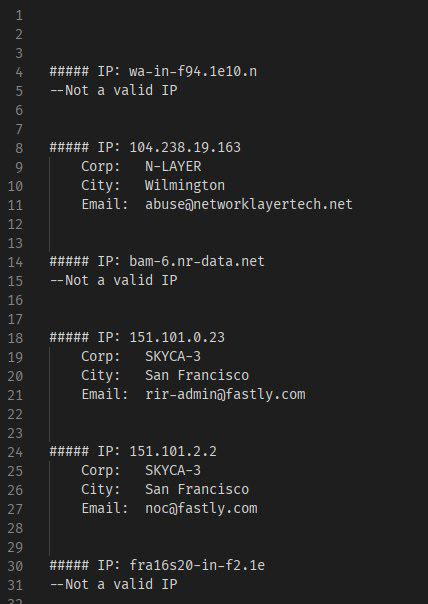

# netstat-whois

Get Whois of each IP Address in `netstat` command.



## How to use

run the script using `python` like below, the result would store in `result.txt`.

```shell
python netstat-whois.py
```

> you can find an example of `netstat` output in the `netstat-sample.txt` file